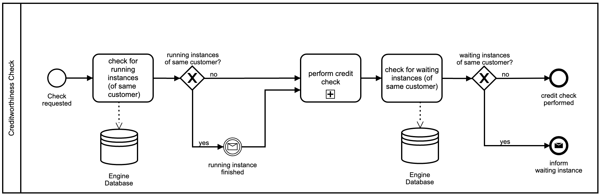
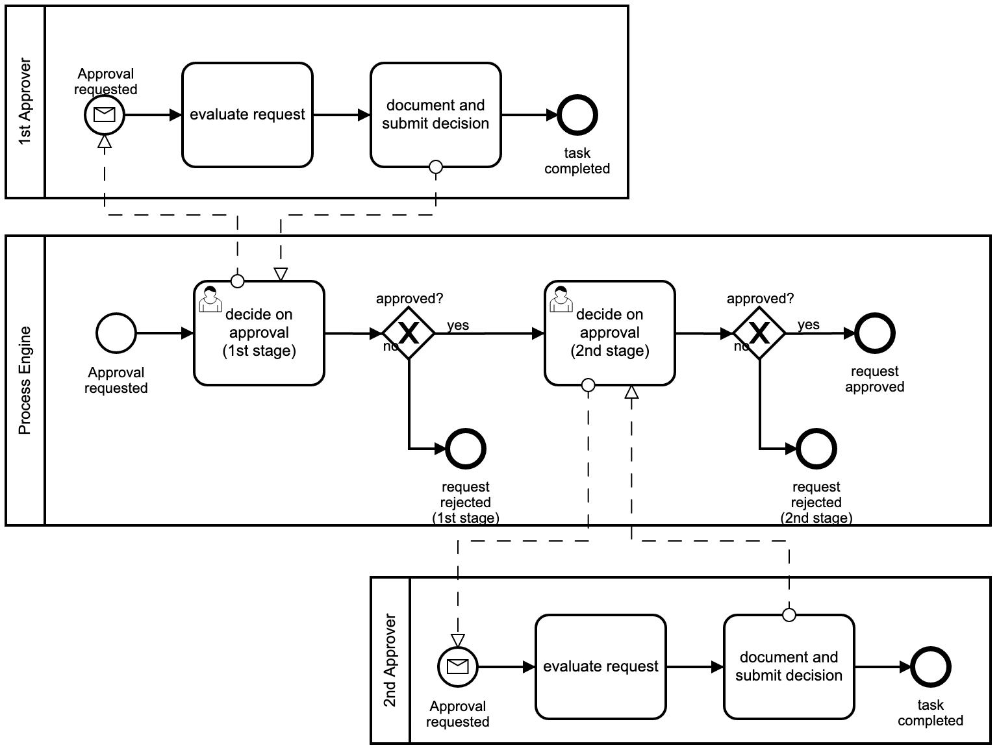
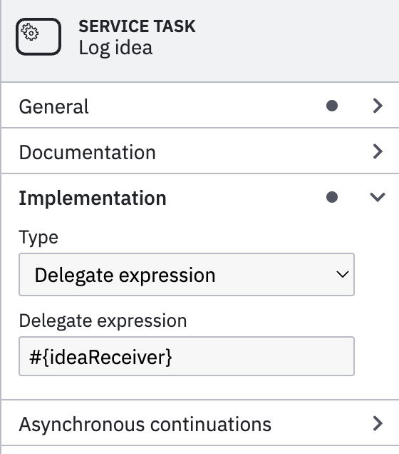
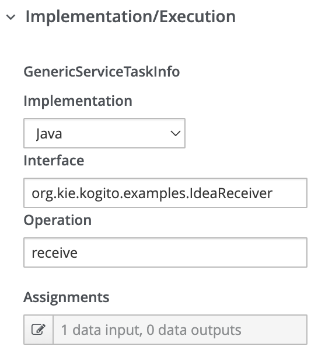

<style>
img {
	max-height: 300px !important;
}
</style>

# About BPM, Camunda, Kogito at a gallopp

Timm Heuss

October 2022

<https://github.com/heussd/bpm-camunda-kogito-at-a-gallop>

---

<!-- .slide: data-background="https://unsplash.com/photos/kn-UmDZQDjM/download?ixid=MnwxMjA3fDB8MXxzZWFyY2h8M3x8bGVnb3xlbnwwfHx8fDE2NjQ5MTQ4NTI&force=true" data-state="intro"-->
<!-- section -->

## Agenda

- BPM and its ecosystem
- Model our own process featuring:
  - human tasks
  - service invokes
- Implement and deploy it...
  - ... in Camunda 7
  - ... in Kogito
- Reflect about our impressions

<!-- section -->

## BPM and it's ecosystem

---

### How BPMN looks like

---

#### Creditworthiness Check



---

#### Four Eyes Principle



---

### Terminology

- **Business Process Management (BPM)**
- **Business Process Model and Notation (BPMN)** - a graphical specification language, used to model a process
- **Decision Model and Notation (DMN)** - used to model decisions
- **BPM suite** - Engine to execute BPM

---

### Why BPM?

1. Economical: You might draw it (in PowerPoint) anyway, why not in a executable standard notation? <!-- .element: class="fragment" data-fragment-index="1" -->
1. Subject Matter: Business people can model the process themselves and they know it best<!-- .element: class="fragment" data-fragment-index="2" -->
   - right?! <!-- .element: class="fragment" data-fragment-index="3" -->
1. Technological: Software that takes care of: <!-- .element: class="fragment" data-fragment-index="4" -->
   - states and versions of processes
   - human / machine interaction

---

### _Completely unbiased_ comparison of approaches

|                  Yes Code                  |          No Code          |
| :----------------------------------------: | :-----------------------: |
| Camunda, Kogito, jBPM, lib-bpmn-engine ... | ServiceNow, Signavio, ... |
|              Developer tools               |     Closed ecosystems     |
|   Embrace standard programming languages   |             ?             |
|             _Your best friend_             | _Death by Property panel_ |

<!-- section -->

## Camunda

---

### [hello-camunda-world](https://github.com/heussd/bpm-camunda-kogito-at-a-gallop/tree/main/hello-camunda-world)

    ├── build.gradle
    ├── gradle.properties
    ├── settings.gradle
    └── src
       └── main
          ├── java
          │  └── com
          │     └── example
          │        └── hello
          │           ├── HealthController.kt
          │           ├── IdeaReceiver.kt
          │           └── SpringBootApp.java
          └── resources
             ├── application.yaml
             ├── idea-approval-process.bpmn
             ├── META-INF
             │  └── processes.xml
             └── public
                └── index.html

Hands on 🙌

---

### Example scenario: Idea approval process

- Step 1: Propose idea.
- Step 2: Approve or reject idea.
- Step 3: Send idea to service, if it is approved.

---

### Highlights

Rich suite with everything you need. Shared, Container Managed Process Engine via SpringBoot starter

|                  Modelling                  |  User Interface   | Admin Interface |
| :-----------------------------------------: | :---------------: | :-------------: |
| Camunda Modeller (Desktop), Cawemo (Online) | Camunda Task List | Camunda Cockpit |

Payed features: Graphical process instance migration, Analytics such as Heatmaps on processes, ...

<!-- section -->

## Red Hat Kogito


---

### [hello-kogito-world](https://github.com/heussd/bpm-camunda-kogito-at-a-gallop/tree/main/hello-kogito-world)

    ├── Dockerfile
    ├── pom.xml
    └── src
       └── main
          ├── java
          │  └── org
          │     └── kie
          │        └── kogito
          │           └── examples
          │              ├── Idea.kt
          │              └── IdeaReceiver.kt
          └── resources
             ├── application.properties
             ├── META-INF
             │  ├── kmodule.xml
             │  └── processSVG
             │     └── idea-approval.svg
             └── org
                └── kie
                   └── kogito
                      └── examples
                         └── idea-approval.bpmn2

Hands on 🫶

---

### Highlights

Hyper-scalable Cloud-native microservice architecture, focus on Domain language and auto generation.

|   Modelling   |                   User Interface                   |                   Admin Interface                   |
| :-----------: | :------------------------------------------------: | :-------------------------------------------------: |
| VSCode plugin | None (Task console available as dedicated service) | None (Admin console available as dedicated service) |

---

Kogito is part of

Red Hat's [KIE (Knowledge Is Everything)](https://www.kie.org/)


<!-- section -->

## Impressions

---

### "The business can model processes"

Yes they can! But keep in mind that:

- Business might not be experienced in doing so.
- It requires a different way of thinking that might not be natural for the Business.
- Modeling a _good_ process is still challenging.

---

What about _executable_ processes?

---

### Business cannot model _executable_ processes

- Additional attributes needed in Property panels:
  - what class to call
  - what data model to use
- Maintaining these requires developer insights

---

|           | BPMN | Property panels |
| :-------: | :--: | :-------------: |
| Business  |  ✅  |       🛑        |
| Developer |  ✅  |       ✅        |

---

### Good practice: How to develop a process

1. Business creates draft process.
1. Developer review, clarify, correct, goto 1. until concept is clear.
1. Developer add technical attributes.
1. Process becomes part of the codebase.
1. Process becomes new baseline for future iterations with business. <!-- .element: class="fragment" data-fragment-index="1" -->

---

### Property panels

Potential "Lock-in" effect through BPM-suite-specific attributes.

|             Camunda             |             Kogito             |
| :-----------------------------: | :----------------------------: |
|  |  |
|        Camunda Modeller         |         VSCode plugin          |

---

### Good practice: How to integrate BPM suites in your application

Work with REST:

1. General management endpoints by the BPM suite.
1. Subject matter-specific endpoints
   - Camunda: do it yourself
   - Kogito: generated automatically

---

### UI integration: input / output forms

Management endpoints!

Also: Custom field types for Camunda

---

#### Kogito `/management` endpoint

```text
/management/processes/

DELETE /management/processes/{processId}/instances/{processInstanceId}
GET /management/processes/{processId}/instances/{processInstanceId}/error
GET /management/processes/{processId}/instances/{processInstanceId}/nodeInstances
DELETE /management/processes/{processId}/instances/{processInstanceId}/nodeInstances/{nodeInstanceId}
POST /management/processes/{processId}/instances/{processInstanceId}/nodeInstances/{nodeInstanceId}
POST /management/processes/{processId}/instances/{processInstanceId}/nodes/{nodeId}
POST /management/processes/{processId}/instances/{processInstanceId}/retrigger
POST /management/processes/{processId}/instances/{processInstanceId}/skip
GET /management/processes/{processId}/nodes
```

---

### UI integration: Modeling

- [bpmn.io](https://bpmn.io/)
  - bpmn-js, dmn-js, form-js (Open Source)
  - [Camunda Modeller](https://github.com/camunda/camunda-modeler) (Open Source)
- Kogito
  - [KIE tools](https://github.com/kiegroup/kie-tools), VSCode Plugin (Open Source)
  - kogito-addons-quarkus-process-svg

---

### Good practice: Process Engine as Single point of truth

UX designers might not like this.

---

### When is a process validated?

|            |        Camunda        |   Kogito   |
| ---------- | :-------------------: | :--------: |
| Model      |      Deployment       | Deployment |
| References | Element instantiation | Deployment |

In Camunda you have to test the entire process to ensure that all referenced classes or data types exist.

---

### Breaking changes in Camunda 8

- User tasks are no longer free for commercial users.
- Only basic primary data types or JSON supported.
- Cawemo replaced with Camunda Platform service.
- Less choices for deployment.

<https://docs.camunda.io/docs/guides/migrating-from-camunda-platform-7/>

---

### Deployment

|                                          | Camunda 7 | Camunda 8 | Kogito |
| ---------------------------------------- | :-------: | :-------: | :----: |
| Remote Process Engine                    |    ✅     |    ✅     |
| Shared, Container Managed Process Engine |    ✅     |    ❌     |   ✅   |
| Embedded Process Engine                  |    ✅     |    ❌     |        |

---

### Kogito's Cloud-native Complexity

- Spinning up a Camunda-equivalent service means starting **8 containers**:
  - Infinispan, Apache Zookeeper, Apache Kafka, Keycloak, Kogito Data Index service, Management console, Task console
  - Plus finally your process deployable
- Public code examples are not working out of the box.

<!-- section -->

## Final thoughts

(personal opinion)

- You have a chain of activities? States? Human-Machine-Interaction? You might need BPM. <!-- .element: class="fragment" data-fragment-index="1" -->
- BPMN is a great means for communication.<!-- .element: class="fragment" data-fragment-index="2" -->
- We are right in the middle of a transition from<!-- .element: class="fragment" data-fragment-index="3" -->
  - _application server_ BPM suites towards ...
  - _Cloud-native_ BPM suites.
- Yes-Code-approaches rock, yet the amount of code you don't have to write is just amazing.<!-- .element: class="fragment" data-fragment-index="4" -->
- Camunda ❤️, Kogito ❤️<!-- .element: class="fragment" data-fragment-index="5" -->

---

Stop drawing boxes in PowerPoint.

Start modelling BPMN.
